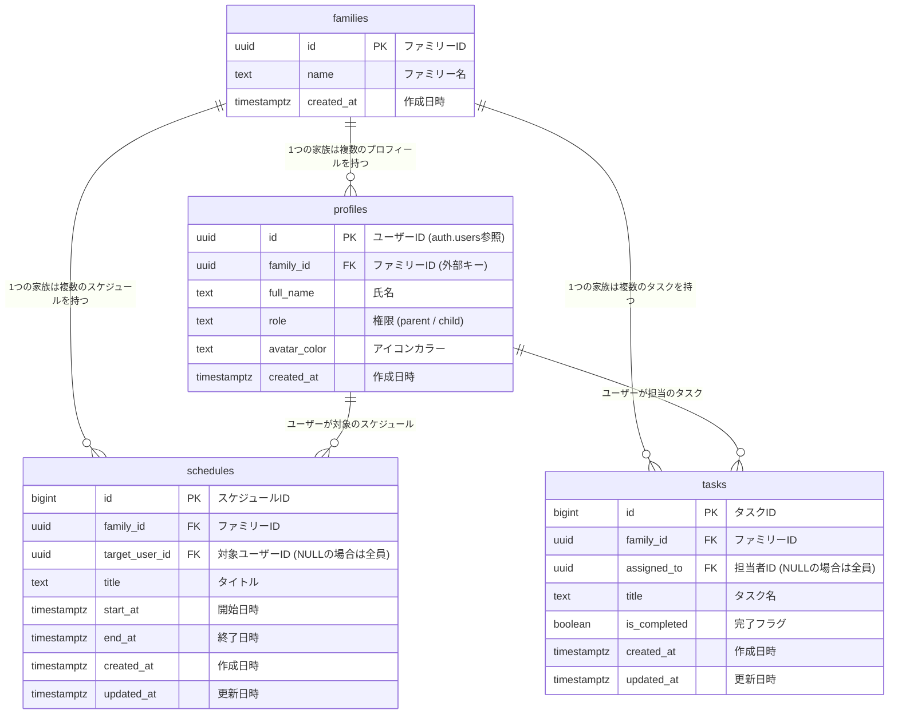

# 👨‍👩‍👧‍👦 MyTime (家族向けスケジュール・タスク共有アプリ)

## 🚧 開発ステータス
現在も継続的に機能追加やUI/UXの改善を行っている開発中のプロジェクトです。
（今後追加・改修予定の機能：家族へのリクエスト送信機能、スケジュールのプッシュ通知など）

## プロジェクトの概要
このプロジェクトは、小学生高学年の子供が自分で時間管理が出来ることを目指し、家族間でのスケジュール調整や日々のタスク管理をスムーズに行うためのファミリー向けWebアプリケーションです。
Next.js (App Router) と Supabase (PostgreSQL) をベースに構築しており、親用・子ども用の権限管理（ロールベースアクセス制御）や、子どもでも直感的に使えるキッズモード、リアルタイムでのスケジュール・タスク共有機能を備えています。

Supabase の Row Level Security (RLS) による安全なデータ保護や、Vercelによる継続的デプロイメント（CD）環境など、実運用を見据えたモダンなアーキテクチャで開発しています。


## 本番環境（Vercel）
https://my-time-navy.vercel.app

###  動作確認用アカウント
アプリの機能をすぐにお試しいただけるデモ用アカウントです。
* **親用アカウント**
  * **Email:** `parent@example.com`
  * **Password:** `password`
* **子ども用アカウント**
  * **Email:** `child@example.com`
  * **Password:** `password`

## 💡 こだわり・実装の工夫点

### 1. 柔軟なロールベースの権限管理（親モード / 子どもモード）
* ログインユーザーの `role`（親または子ども）をデータベースから動的に判定し、アクセス時に適切なダッシュボードへ自動ルーティングします。ヘッダーや操作権限もロールに応じて切り替わる設計にしています。

### 2. 子ども向けUIとデータフィルタリング（キッズモード）
* 子ども用画面では、自分宛てのタスクや予定、または家族全員共通のスケジュールのみがわかりやすく表示されるよう、Supabaseのクエリと `.or()` 条件を駆使してデータを安全にフィルタリングしています。

### 3. ファミリーごとのリアルタイム共有・一元管理
* 家族ID（`family_id`）を軸に、スケジュール、タスク、メンバー情報が一元管理されており、家族の予定の重複ややり忘れを防ぐ使いやすいUI/UXにこだわっています。

### 4. Supabase RLS（行レベルセキュリティ）による安全なデータ分離
* データベース側で Row Level Security (RLS) を有効化し、同じ家族（`family_id`）に属するユーザー同士のみが安全に情報を共有・参照できる堅牢なポリシーを構築しています。


## 環境構築（Next.js）
  1. リポジトリをクローンし、プロジェクトフォルダに移動
``` bash
git clone https://github.com/yun-0312/my-time.git
cd my-time
```
  2. 依存関係のインストール
``` bash
npm install
```
 3. 環境変数ファイル（.env.local）の作成
 プロジェクトルートに .env.local を作成し、SupabaseおよびGroqの認証情報を設定します。
``` bash
NEXT_PUBLIC_SUPABASE_URL=あなたのSupabaseプロジェクトURL
NEXT_PUBLIC_SUPABASE_ANON_KEY=あなたのSupabaseAnonKey
SUPABASE_SERVICE_ROLE_KEY=あなたのSupabaseRoleKey
```
  4. 依存関係のインストール
``` bash
npm run dev
```
ブラウザで http://localhost:3000 にアクセスして動作を確認できます。


## 実装機能一覧
*  認証機能: 会員登録、ログイン / ログアウト、ロール自動判定リダイレクト（Supabase Auth）
* スケジュール管理 (CRUD):
・家族全員または個別メンバー向けのスケジュール登録・編集・削除<br />
・カレンダービューでの予定確認<br />
* タスク管理 (CRUD):
・担当者指定可能なタスクの追加・完了状態の切り替え・削除<br />
* マルチデバイス対応: レスポンシブデザインによるスマホ・PCからの快適なアクセス

## 使用技術
          <br />
  ・Frontend: Next.js (App Router) / React / TypeScript / Tailwind CSS / Lucide Icons<br />
・Backend / DB: Supabase (PostgreSQL / Auth / Row Level Security)<br />
  ・Deployment: Vercel (CI/CD)<br />

## ER図

* リレーションシップ: families テーブルを基軸として profiles、schedules、tasks が紐づくマルチテナント形式に近い構造を採用しています。

* RLSポリシー: 各テーブルに family_id を持たせることで、同じ家族に所属するメンバーだけがデータを安全に共有・閲覧できるセキュリティ設計にしています。


## URL
・Vercel本番環境：https://my-time-navy.vercel.app
